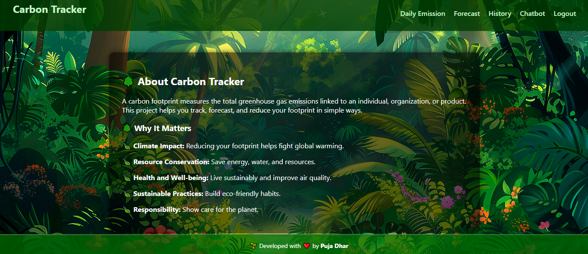
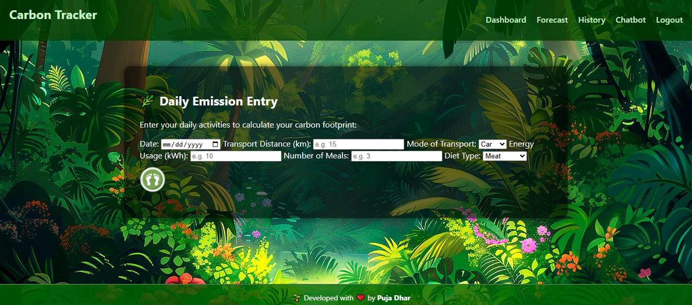
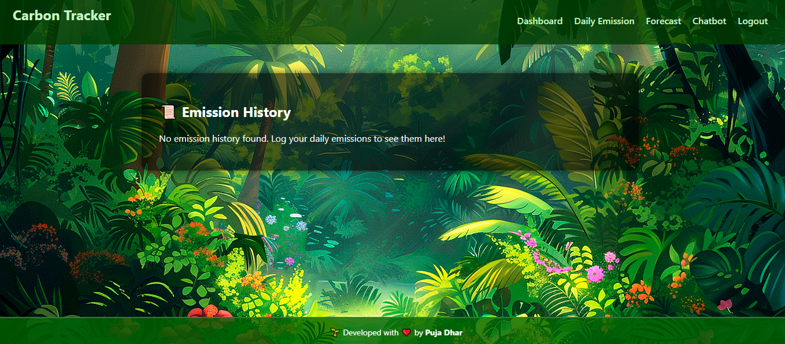
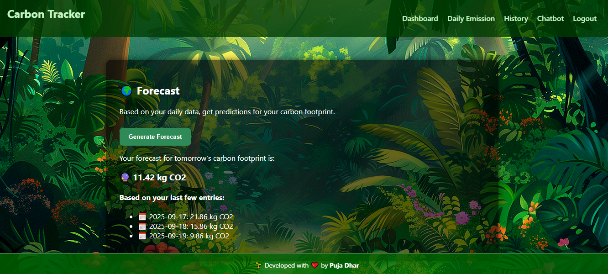

# 🌍 Carbon Tracker AI  

Carbon Tracker is a **full-stack AI project** that helps users **track daily CO₂ emissions**, view their **history**, and get **future forecasts** using Machine Learning. It also includes an **AI-powered chatbot** for interactive support, all wrapped in a clean jungle-themed UI.  

---

## Features
- **User Authentication** – Secure login & registration with JWT  
- **Daily Emission Tracking** – Calculate transport, energy, and diet-based emissions  
- **History View** – Browse past emissions datewise  
- **AI Forecasting** – Predict future emissions using Random Forest regression  
- **Chatbot Support** – AI assistant powered by Hugging Face DialoGPT  
- **Frontend** – Responsive jungle-themed design with HTML, CSS, and JavaScript  
- **Backend** – Flask API with SQLite database  

---

##  Tech Stack
**Frontend:** HTML, CSS, JavaScript  
**Backend:** Python (Flask, Flask-CORS, Flask-JWT-Extended)  
**Database:** SQLite  
**AI/ML:** Scikit-learn (Random Forest), Hugging Face Transformers (DialoGPT)  

---

## Screenshots
**Dashboard**


**Daily Emission**


**History**


**forecast**

##  Getting Started

### 1. Clone the Repository
```bash
git clone https://github.com/BeingPuja/Carbon-Tracker-AI.git
cd Carbon-Tracker-AI
2. Install Dependencies
pip install -r requirements.txt

3. Run the Backend
cd backend
python app.py


Backend will start at: http://127.0.0.1:5000

4. Run the Frontend

Open frontend/index.html in your browser.

 Project Structure
carbon-tracker-ai/
│── backend/           # Flask backend
│   ├── app.py         # Main backend app
│   ├── calculator.py  # Emission calculation logic
│   ├── forecast.py    # ML model for forecasting
│   ├── models.py      # Database models
│   ├── database.py    # SQLite connection
│
│── frontend/          # Frontend files
│   ├── index.html     # Login/Register
│   ├── forgot.html     # if forget the credentials to login
│   ├── daily.html     # Daily emission page
│   ├── history.html   # Emission history
│   ├── forecast.html  # Forecast visualization
│   ├── chat.html      # Chatbot interface
│   ├── dashboard.html # Main dashboard
│   ├── style.css      # Jungle-themed styling
│   ├── script.js      # Frontend logic
│
│── requirements.txt   # Python dependencies
│── README.md          # Project documentation

 Future Improvements

Optimize forecast model training (cache results)

Enhance chatbot context handling

Deploy on Streamlit / Docker / Render
